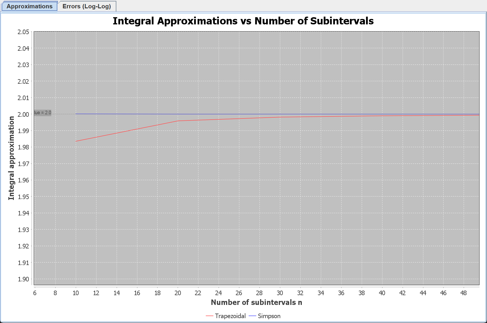
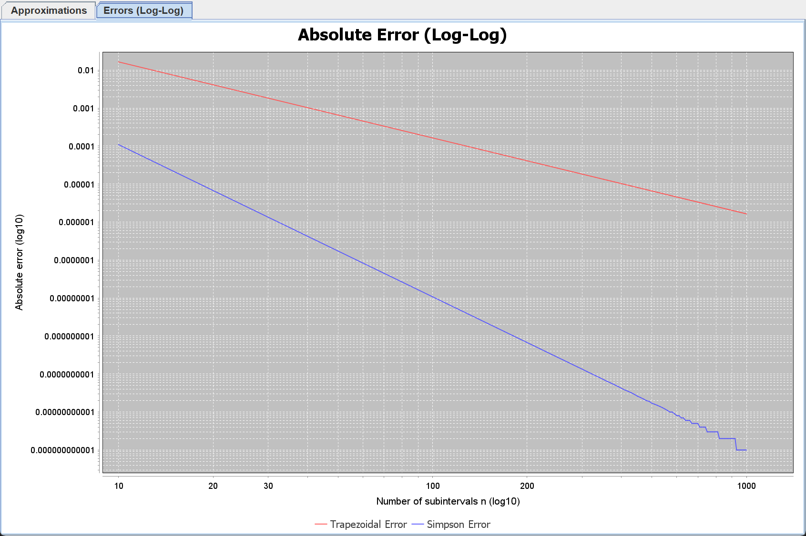

# 数值计算

## Question01
源代码：[Function.java](src/main/java/com/ecnu/Function.java)

## Question02
源代码：[DifferentiableFunction.java](src/main/java/com/ecnu/DifferentiableFunction.java)

## Question03
源代码：
- [Linear.java](src/main/java/com/ecnu/function/Linear.java)
- [Quadratic.java](src/main/java/com/ecnu/function/Quadratic.java)
- [Sin.java](src/main/java/com/ecnu/function/Sin.java)
- [NormalPDF.java](src/main/java/com/ecnu/function/NormalPDF.java)

说明：
- `Linear` 表示线性函数 $f(x)=kx+b$，同时实现了导数计算。
- `Quadratic` 表示二次函数 $f(x)=ax^2+bx+c$，并提供对应导数。
- `Sin` 表示 $f(x)=\sin(\omega x+\phi)$，导数为 $\omega\cos(\omega x+\phi)$。
- `NormalPDF` 表示标准形式的高斯函数核，并实现其导数。

测试说明：
- [FunctionTest.java](src/test/java/com/ecnu/function/FunctionTest.java) 主要验证 `function` 包中各类的 `eval` 和 `diff` 结果是否符合公式。
- 测试覆盖了线性函数、二次函数、正弦函数、正态分布函数，以及 `Function` 接口的多态调用场景。

## Question04
源代码：[NewtonRoot.java](src/main/java/com/ecnu/root/NewtonRoot.java)

测试说明：
- [NewtonRootTest.java](src/test/java/com/ecnu/root/NewtonRootTest.java) 主要验证 Newton 法求根的正确性。
- 测试覆盖了线性函数、二次函数、正弦函数的根求解结果，并验证了对没有实根的正态分布函数会抛出异常。

## Question05
源代码：[NewtonCotes.java](src/main/java/com/ecnu/integration/NewtonCotes.java)

测试说明：
- [NewtonCotesTest.java](src/test/java/com/ecnu/integration/NewtonCotesTest.java) 主要验证数值积分公式的正确性。
- 梯形公式使用线性函数进行测试，在 `n=10` 的复合划分下验证积分结果与解析积分一致。
- 辛普森公式使用 $\int_0^\pi \sin(x)\,dx$ 进行测试，在 `n=100` 的复合划分下数值结果逼近 2。

## Question06
### 6.0 准备数据
源代码：[IntegrationConvergenceTest.java](src/main/java/com/ecnu/driver/IntegrationConvergenceTest.java)

说明：
- 计算结果定向输出到 [sin_integral.csv](data/sin_integral.csv)

### 6.1 可视化方案

本部分使用 **Java Swing + JFreeChart** 库对数值积分结果进行可视化展示，完全在本地运行，无需额外安装环境。

- **数据来源**：运行 [IntegrationConvergenceTest](src/main/java/com/ecnu/driver/IntegrationConvergenceTest.java) 驱动类，计算函数 \( f(x) = \sin(x) \) 在区间 \([0, \pi]\) 上的定积分（真实值 \(2.0\)）。  
  划分段数 \( n \) 从 10 到 1000（步长 10），分别使用**复化梯形公式**和**复化 Simpson 公式**计算积分值与绝对误差，结果保存为 [sin_integral.csv](data/sin_integral.csv)。
- **可视化实现**：[IntegralChart](src/main/java/com/ecnu/visualization/IntegralChart.java) 类读取 CSV 数据，并绘制两个图表：
  1. **积分值收敛图**：\( n \) vs 积分近似值（线性坐标），对比两种方法随 \( n \) 增大趋近真实值 \(2.0\) 的过程。
  2. **误差双对数图**：\( n \)（log 坐标） vs 绝对误差（log 坐标），直观对比两种方法的误差收敛速度（斜率）。

### 6.2 如何运行可视化

#### 使用 Maven（推荐）
```bash
mvn exec:java -Dexec.mainClass="com.ecnu.Main"
```
该命令会自动解析所有依赖（包括 JFreeChart），弹出图形窗口。

#### 手动运行（需包含依赖 JAR）
如果希望直接使用 `java` 命令运行，请先构建 classpath：
```bash
mvn dependency:build-classpath -Dmdep.outputFile=classpath.txt
# Linux/macOS
java -cp "target/classes:$(cat classpath.txt)" com.ecnu.Main
# Windows PowerShell
$cp = Get-Content classpath.txt -Raw
java -cp "target/classes;$cp" com.ecnu.Main
```

### 6.3 预期可视化效果

#### 图1：积分值收敛曲线
- **横轴**：划分段数 \( n \)（线性）
- **纵轴**：积分近似值（线性）
- **曲线**：梯形公式（蓝色）、Simpson 公式（红色）
- **参考线**：真实值 \( y=2.0 \)（黑色虚线）

**特征**：
- 两条曲线均随 \( n \) 增加单调趋近于 2.0。
- Simpson 公式收敛速度明显快于梯形公式：当 \( n \approx 40 \) 时，Simpson 曲线已几乎与真实值重合；梯形公式需 \( n \approx 200 \) 才能达到相近精度。

**参考**：


#### 图2：绝对误差双对数图
- **横轴**：\( n \)（以 10 为底对数坐标）
- **纵轴**：绝对误差（以 10 为底对数坐标）
- **曲线**：梯形误差（蓝色）、Simpson 误差（红色）

**特征**：
- 两组误差在双对数坐标系下均呈现**近似直线**，表明误差与 \( n^{-p} \) 成正比。
- 梯形误差线的**斜率约为 -2**，验证了复化梯形公式的误差阶为 \( O(h^2) = O(n^{-2}) \)。
- Simpson 误差线的**斜率约为 -4**，验证了复化 Simpson 公式的误差阶为 \( O(h^4) = O(n^{-4}) \)。
- 同一 \( n \) 下，Simpson 误差显著小于梯形误差（相差 2~3 个数量级）。

**参考**：


> 注：实际斜率可能因函数二阶、四阶导数的影响略有波动，但整体趋势符合理论分析。

### 6.4 结论

- **复化梯形公式**实现简单，但收敛较慢（二阶精度）。
- **复化 Simpson 公式**需要多计算中点函数值，但收敛速度更快（四阶精度），适合要求高精度的数值积分问题。
- 通过双对数图可以直观比较不同数值方法的误差收敛阶，是数值分析中常用的验证手段。

### 6.5 文件说明

- [sin_integral.csv](data/sin_integral.csv)：积分计算结果原始数据（n, 梯形值, 梯形误差, Simpson值, Simpson误差）。
- [IntegralChart](src/main/java/com/ecnu/visualization/IntegralChart.java)：可视化主类。
- [Main](src/main/java/com/ecnu/Main.java)：程序入口，直接调用可视化窗口。

### 6.6 Vibe-coding记录
- [chat.json](chat.json)

